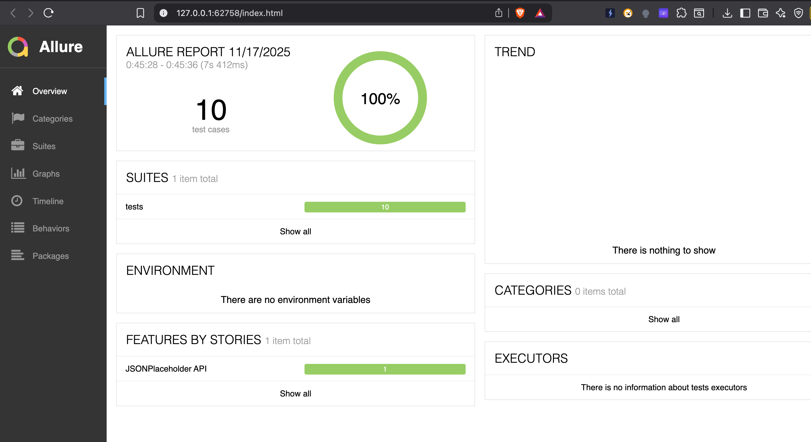
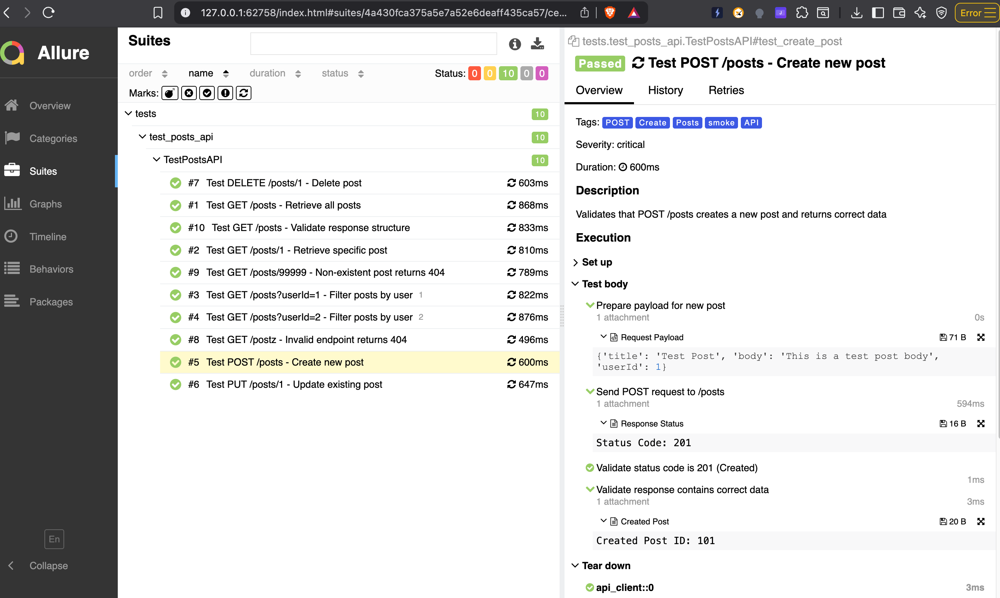

# API Test Automation Framework

A production-quality API automation framework built with Python and pytest to test the JSONPlaceholder Posts API.

## Features

- **Modular Architecture**: Follows SOLID principles and DRY practices
- **Comprehensive Testing**: Positive and negative test scenarios
- **JSON Schema Validation**: Validates API responses against defined schemas
- **Smart Logging**: Enhanced Loguru-based logging with color-coded output and automatic organization
- **Allure Reporting**: Beautiful, interactive HTML reports using Allure Report
- **CI/CD Integration**: GitHub Actions workflow for continuous testing
- **Retry Mechanism**: Automatic retry with exponential backoff for failed requests

## Project Structure

```
electrolux-sdet-assignment/
├── src/
│   ├── api_client.py          # HTTP client wrapper with retry mechanism
│   └── response_handler.py    # Response validation and parsing logic
├── utils/
│   └── logger.py              # Logging utility with date-based organization
├── schemas/
│   └── post_schema.json       # JSON schema for post objects
├── tests/
│   ├── conftest.py            # Pytest fixtures and configuration
│   └── test_posts_api.py      # Comprehensive test suite
├── Logs/                      # Auto-generated logs folder
│   └── YYYY-MM-DD/           # Date-based log folders
│       └── run_HHMMSS.log    # Timestamped log files
├── reports/allure/            # Allure test results (raw data)
├── .github/
│   └── workflows/
│       └── ci.yml            # GitHub Actions CI configuration
├── pytest.ini                # Pytest configuration
├── requirements.txt          # Python dependencies
└── README.md                # This file
```

## Setup Instructions

### Prerequisites

- Python 3.8 or higher
- pip (Python package manager)
- Java 8 or higher (required for Allure Report)

### Installation

1. **Clone the repository** (if applicable):
   ```bash
   git clone <repository-url>
   cd electrolux-sdet-assignment
   ```

2. **Create a virtual environment**:
   ```bash
   python -m venv .venv
   ```

3. **Activate the virtual environment**:
   
   On macOS/Linux:
   ```bash
   source .venv/bin/activate
   ```
   
   On Windows:
   ```bash
   .venv\Scripts\activate
   ```

4. **Install dependencies**:
   ```bash
   pip install -r requirements.txt
   ```

5. **Install Allure Command-line Tool** (for viewing reports):
   
   On macOS (using Homebrew):
   ```bash
   brew install allure
   ```
   
   On Linux:
   ```bash
   # Download and extract Allure
   wget https://github.com/allure-framework/allure2/releases/download/2.24.0/allure-2.24.0.tgz
   tar -zxvf allure-2.24.0.tgz
   sudo mv allure-2.24.0 /opt/allure
   sudo ln -s /opt/allure/bin/allure /usr/local/bin/allure
   ```
   
   On Windows (using Scoop):
   ```bash
   scoop install allure
   ```

## Running Tests

### Run All Tests

```bash
pytest
```

### Run Smoke Tests Only

```bash
pytest -m smoke
```

### Run Regression Tests Only

```bash
pytest -m regression
```

### Run a Specific Test

```bash
pytest tests/test_posts_api.py::TestPostsAPI::test_get_all_posts
```

### Run with Custom Base URL

```bash
pytest --base-url="https://jsonplaceholder.typicode.com"
```

### Run with Verbose Output

```bash
pytest -v
```

## Test Coverage

The framework includes comprehensive test coverage:

### Positive Tests
- ✅ GET /posts - Retrieve all posts
- ✅ GET /posts/{id} - Retrieve specific post
- ✅ GET /posts?userId={n} - Filter posts by user ID
- ✅ POST /posts - Create new post
- ✅ PUT /posts/{id} - Update existing post
- ✅ DELETE /posts/{id} - Delete post
- ✅ GET /posts - Validate response structure and field types

### Negative Tests
- ✅ Invalid endpoint returns 404
- ✅ Non-existent post ID returns 404

### Validation
- ✅ HTTP status code validation
- ✅ JSON schema validation
- ✅ Response structure validation
- ✅ Field type validation
- ✅ Field value validation

## Allure Reporting

After running tests, Allure test results are automatically saved to `reports/allure/`.

### Generating and Viewing Reports

**Generate and open report in browser**:
```bash
allure serve reports/allure
```

This command will:
- Generate a beautiful HTML report from test results
- Start a local web server
- Automatically open the report in your default browser

**Generate report to a specific directory**:
```bash
allure generate reports/allure -o reports/allure-report --clean
```

**Open existing report**:
```bash
allure open reports/allure-report
```

### Report Features

Allure reports include:
- 📊 Interactive dashboard with test statistics
- 📈 Visual charts and graphs
- 🔍 Test execution timeline
- 📝 Detailed test steps and logs
- 📎 Screenshots and attachments
- 🏷️ Test categorization by features, stories, and severity
- 📉 Trend analysis across multiple test runs
- ⚡ Fast navigation and filtering

### Sample Reports

**Allure Dashboard Overview**

The main dashboard provides a comprehensive overview of test execution with pass/fail statistics, test distribution, and feature breakdown:



**Detailed Test Execution View**

Each test displays detailed execution steps, including request/response information, validations performed, and attachments for better debugging:



Key features shown in the detailed view:
- ✅ Step-by-step test execution flow
- 📎 Request payload and response status attachments
- ⏱️ Individual step duration tracking
- 🏷️ Test tags, severity, and categorization
- 📋 Setup and teardown fixture information

## Logging

Logs are automatically organized in a structured manner:

**Location**: `Logs/YYYY-MM-DD/run_HHMMSS.log`

Example: `Logs/2025-11-16/run_143052.log`

### Enhanced Loguru Features
- 🎨 **Color-coded console output** for different log levels
- ⏱️ **Millisecond precision** timestamps (YYYY-MM-DD HH:mm:ss.SSS)
- 📍 **Context information**: module, function, and line numbers
- 🎯 **Better formatting** for improved readability

### Log Levels
- **DEBUG**: Detailed diagnostic information (file only)
- **INFO**: General informational messages (console + file)
- **WARNING**: Warning messages
- **ERROR**: Error messages
- **CRITICAL**: Critical error messages

Logs include:
- Request/response details with timing
- Validation results
- Test execution flow
- Detailed error traces with context
- Module and function information

## CI/CD Pipeline

The project includes a GitHub Actions workflow that automatically:

1. Checks out the repository
2. Sets up Python environment
3. Installs dependencies
4. Runs the test suite
5. Generates HTML reports
6. Uploads reports and logs as artifacts

**Workflow file**: `.github/workflows/ci.yml`

**Triggers**:
- Push to main/master/develop branches
- Pull requests
- Manual workflow dispatch

**Artifacts**:
- Allure test results (retained for 30 days)
- Test logs (retained for 30 days)
- Generated Allure HTML report (retained for 30 days)

## Configuration

### pytest.ini

The `pytest.ini` file contains pytest configuration:

```ini
[pytest]
addopts = -vs -rf --alluredir=reports/allure/
testpaths = tests
markers =
    smoke: Quick smoke tests for critical functionality
    regression: Full regression test suite
```

### Test Markers

- `@pytest.mark.smoke`: Critical tests that must pass
- `@pytest.mark.regression`: Comprehensive regression tests

### Fixtures

The `tests/conftest.py` file provides reusable fixtures for test setup and teardown:

#### Available Fixtures

**`base_url`** (scope: session)
- Provides the base URL for API tests
- Default: `https://jsonplaceholder.typicode.com`
- Can be overridden via command line: `pytest --base-url="https://custom-url.com"`
- Usage: Automatically injected into `api_client` fixture

**`logger`** (scope: session)
- Provides a configured logger instance for tests
- Based on Loguru with color-coded output
- Usage: `def test_example(logger): logger.info("Test started")`

**`api_client`** (scope: function)
- Provides a ready-to-use API client instance
- Automatically configured with base URL and logger
- Includes automatic cleanup after each test (closes session)
- Pre-configured with timeout=10s and max_retries=3
- Usage: `def test_example(api_client): response = api_client.get("/posts")`

**`response_handler`** (scope: session)
- Provides a ResponseHandler instance for validating API responses
- Used for status code, JSON, and schema validation
- Usage: `def test_example(response_handler): response_handler.assert_status_code(response, 200)`

**`post_schema`** (scope: session)
- Loads and provides the JSON schema for post validation
- Schema loaded from `schemas/post_schema.json`
- Used with response_handler for schema validation
- Usage: `def test_example(post_schema, response_handler): response_handler.validate_schema(data, post_schema)`

**`log_separator_after_test`** (autouse: True)
- Automatically adds visual separators in logs after each test
- No need to explicitly use this fixture - it's automatically applied to all tests
- Improves log readability by clearly marking test boundaries

#### Example Usage

```python
def test_get_all_posts(api_client, response_handler, post_schema, logger):
    """Example test showing fixture usage."""
    logger.info("Starting test...")
    
    # api_client is ready to use
    response = api_client.get("/posts")
    
    # Validate response
    response_handler.assert_status_code(response, 200)
    data = response_handler.parse_json(response)
    
    # Validate schema
    response_handler.validate_schema(data[0], post_schema)
    
    logger.info("Test completed successfully")
```

## Architecture

### API Client (`src/api_client.py`)

- Wraps `requests.Session` for HTTP communication
- Supports GET, POST, PUT, DELETE methods
- Configurable timeout and retry mechanism
- Automatic request/response logging
- Follows Single Responsibility Principle

### Response Handler (`src/response_handler.py`)

- Centralized response validation logic
- Status code assertions
- JSON parsing with error handling
- Schema validation using jsonschema
- Field existence and type validation
- Reusable helper methods

### Logger (`utils/logger.py`)

- **Loguru-based** for enhanced logging
- **Color-coded console output** for better readability
- Automatic date-based folder creation: `Logs/YYYY-MM-DD/`
- Timestamped log files: `run_HHMMSS.log`
- Dual output: file (DEBUG) and console (INFO)
- **Millisecond precision** timestamps
- **Better formatting** with module and function names
- Singleton pattern for consistent logging

## Best Practices Implemented

✅ **SOLID Principles**: Each module has a single responsibility  
✅ **DRY (Don't Repeat Yourself)**: Reusable components and fixtures  
✅ **Separation of Concerns**: Clear separation between API client, validation, and tests  
✅ **Type Hints**: Improved code readability and IDE support  
✅ **Documentation**: Comprehensive docstrings and comments  
✅ **Error Handling**: Proper exception handling and meaningful error messages  
✅ **Logging**: Detailed logging for debugging and auditing  
✅ **Schema Validation**: Contract testing using JSON schemas  
✅ **Fixtures**: Reusable test fixtures for setup/teardown  
✅ **Parametrization**: Data-driven tests using pytest.mark.parametrize  

## Dependencies

- **requests**: HTTP library for API calls
- **pytest**: Testing framework
- **allure-pytest**: Allure Report integration for pytest
- **jsonschema**: JSON schema validation
- **urllib3**: HTTP client (used by requests)
- **loguru**: Advanced Python logging library with color support

## Troubleshooting

### Tests Failing

1. Check internet connectivity
2. Verify the API is accessible: https://jsonplaceholder.typicode.com/posts
3. Review logs in `Logs/YYYY-MM-DD/run_HHMMSS.log`

### Import Errors

1. Ensure virtual environment is activated
2. Reinstall dependencies: `pip install -r requirements.txt`

### Report Not Generated

1. Check pytest.ini configuration
2. Verify allure-pytest is installed: `pip list | grep allure`
3. Ensure write permissions for `reports/allure/` directory
4. Install Allure command-line tool: `allure --version`


**Built with ❤️ using Python and pytest**

